# ChemoSpec2D


## calcLvls

```r
set.seed(9)
MM <- matrix(runif(100, -1, 1), nrow = 10) # test data
tsts <- c("even", "log", "poslog", "exp", "posexp", "ecdf", "NMR")
for (i in 1:length(tsts)) {
	nl <- 10
	if(tsts[i] == "ecdf")  nl <- seq(0.1, 0.9, 0.1)
	levels <- calcLvls(M = MM, n = nl, mode = tsts[i],
   showHist = TRUE, main = tsts[i])
	}
```

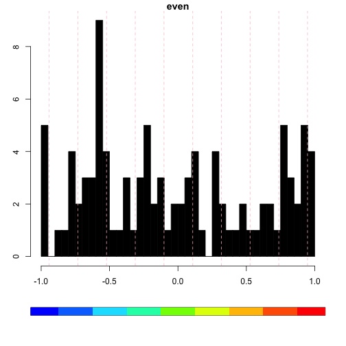

## centscaleSpectra2D

```r
data(MUD1)
tst <- centscaleSpectra2D(MUD1)
```


## inspectLvls

```r
data(MUD1)
inspectLvls(MUD1, ylim = c(0, 50), main = "All MUD1 Data, mode = even")
```

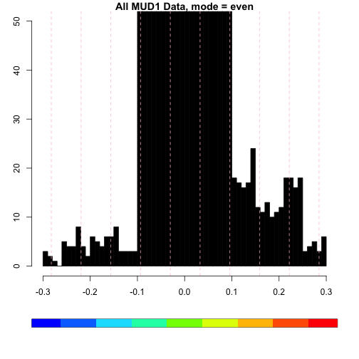

```r
inspectLvls(MUD1, ylim = c(0, 50), mode = "NMR",  main = "All MUD1 Data, mode = NMR")
```


## miaSpectra2D

```r
data(MUD1)
res <- miaSpectra2D(MUD1)
```

```
## PCASUP: eigenvalues mode C
##         Eigenvalue Fit(%)
## Comp.1       13.45  16.62
## Comp.2       11.99  31.44
## Comp.3        7.65  40.90
## Comp.4        7.48  50.15
## Comp.5        7.03  58.84
## Comp.6        6.94  67.41
## Comp.7        6.78  75.79
## Comp.8        6.70  84.07
## Comp.9        6.52  92.13
## Comp.10       6.37 100.00
```

```r
plotScores(MUD1, res, main = "MIA Scores", tol = 0.1, ellipse = "cls")
```


```r
plotScree(res)
```

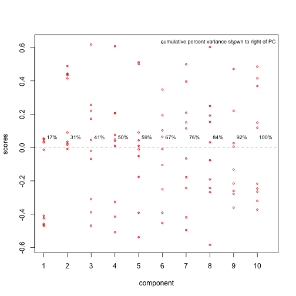

```r
MUD1a <- miaLoadings(MUD1, res, load_lvls = c(-0.4, -0.2, 0.2, 0.4),
  main = "MIA Comp. 1 Loadings")
```

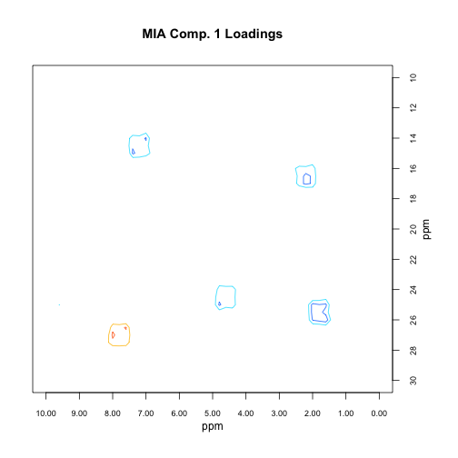

```r
# Selection of loading matrix levels can be aided by the following

inspectLvls(MUD1a, loadings = TRUE, ylim = c(0, 10),
  main = "Histogram of Loadings Matrix")
```

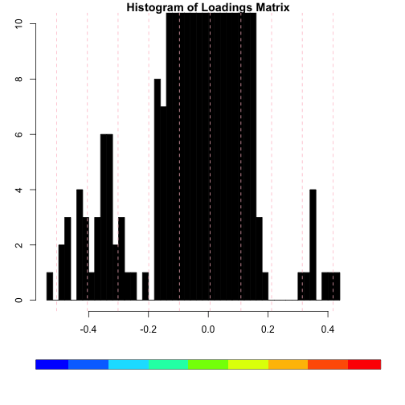

## MUD1

```r
data(MUD1)
sumSpectra(MUD1)
```

```
## 
##  MUD1: HSQC-like data for ChemoSpec2D demo & testing 
## 
## 	There are 10 spectra in this set.
## 
## 	The F2 dimension runs from 0 to 10 ppm
## 	and there are 51 data points.
## 
## 	The F1 dimension runs from 10 to 30 ppm
## 	and there are 41 slices.
## 
## 	The spectra are divided into 2 groups: 
## 
##    group no. color
## 1 GroupA   5   red
## 2 GroupB   5  blue
## 
## 
## *** Note: this is an S3 object
## of class 'Spectra2D'
```

## normSpectra2D

```r
data(MUD1)
MUD1n <- normSpectra2D(MUD1)
MUD1b <- removeFreq(MUD1, remF2 = 2.5 ~ 3.5)
MUD1bn <- normSpectra2D(MUD1b)
```


## pfacSpectra2D

```r
data(MUD1)
set.seed(123)
res <- pfacSpectra2D(MUD1, parallel = FALSE, nfac = 2)
```

```
## 
  |                                                                       
  |                                                                 |   0%
  |                                                                       
  |======                                                           |  10%
  |                                                                       
  |=============                                                    |  20%
  |                                                                       
  |====================                                             |  30%
  |                                                                       
  |==========================                                       |  40%
  |                                                                       
  |================================                                 |  50%
  |                                                                       
  |=======================================                          |  60%
  |                                                                       
  |==============================================                   |  70%
  |                                                                       
  |====================================================             |  80%
  |                                                                       
  |==========================================================       |  90%
  |                                                                       
  |=================================================================| 100%
```

```r
plotScores(MUD1, res, tol = 0.1, leg.loc = "topright",
  ellipse = "cls", main = "PARAFAC Score Plot")
```

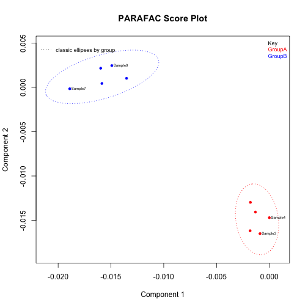

```r
res1 <- pfacLoadings(MUD1, res,
  load_lvls = seq(-12, -2, 2),
  main = "PARAFAC Comp. 1 Loadings")
```

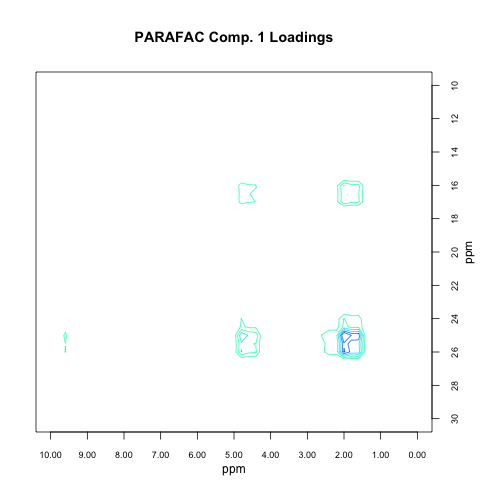

```r
res2 <- pfacLoadings(MUD1, res, load_lvls = seq(-12, -2, 2),
  ref = 2, ref_lvls = c(-0.2, -0.1, 0.1, 0.2),
  ref_cols = c("violet", "violet", "orange", "orange"),
  main = "PARAFAC Comp. 1 Loadings + Ref. Spectrum")
```

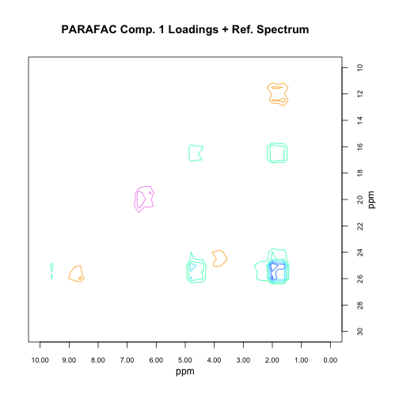

```r
# Selection of loading matrix levels can be aided by the following

inspectLvls(res1, loadings = TRUE, ylim = c(0, 50),
  main = "Histogram of Loadings Matrix")
```

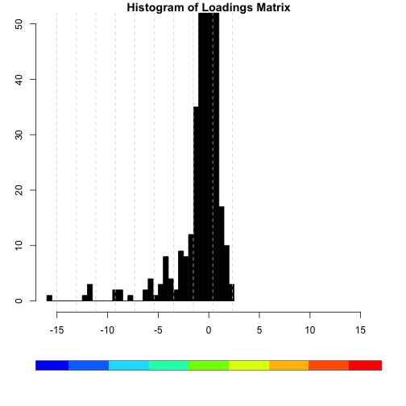


## plotSlice

```r
data(MUD1)
plotSlice(MUD1, F1 = 25, main = "Slice @ F1 = 25 ppm")
```

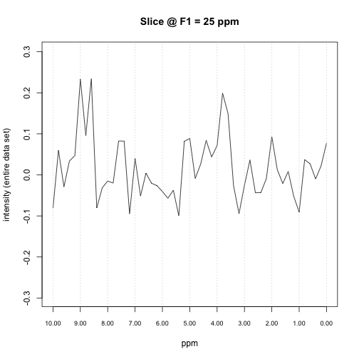

## plotSpectra2D

```r
data(MUD1)
mylvls <- seq(-0.3, 0.3, 0.1)[-4]
plotSpectra2D(MUD1, which = 7, lvls = mylvls,
  main = "MUD1 Sample 7")
```

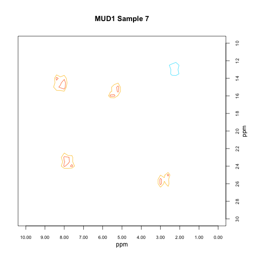

```r
plotSpectra2D(MUD1, which = c(1, 6), lvls = list(mylvls, mylvls),
  cols = list(rep("black", 6), rep("red", 6)),
  main = "MUD1 Sample 1 (black) & Sample 6 (red)")
```

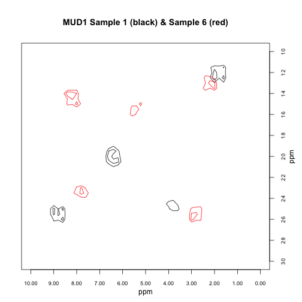


## removePeaks2D

```r
# Note we will set contours a bit low to better
# show what is going on.

data(MUD1)
mylvls <- seq(-0.3, 0.3, 0.1)
mylvls[4] <- 0.05

plotSpectra2D(MUD1, which = 7, lvls = mylvls,
  main = "MUD1 Sample 7: Complete Data Set")
```

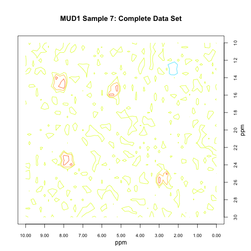

```r
MUD1a <- removePeaks2D(MUD1, remF2 = 2.5 ~ 4)
sumSpectra(MUD1a)
```

```
## 
##  MUD1: HSQC-like data for ChemoSpec2D demo & testing 
## 
## 	There are 10 spectra in this set.
## 
## 	The F2 dimension runs from 0 to 10 ppm
## 	and there are 51 data points.
## 
## 	The F1 dimension runs from 10 to 30 ppm
## 	and there are 41 slices.
## 
## 	NAs were found in the data matrices.  To see where, use plotSpectra2D.
## 
## 	The spectra are divided into 2 groups: 
## 
##    group no. color
## 1 GroupA   5   red
## 2 GroupB   5  blue
## 
## 
## *** Note: this is an S3 object
## of class 'Spectra2D'
```

```r
plotSpectra2D(MUD1a, which = 7, lvls = mylvls,
  main = "MUD1 Sample 7\\nRemoved Peaks: F2 2.5 ~ 4")
```

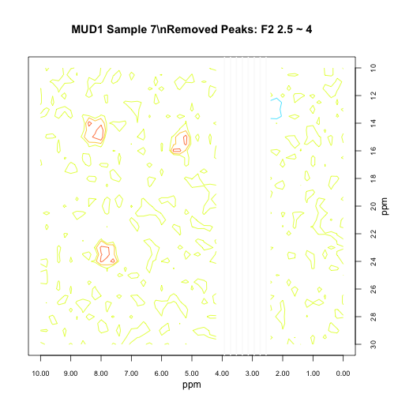

```r
MUD1b <- removePeaks2D(MUD1, remF2 = low ~ 5)
sumSpectra(MUD1b)
```

```
## 
##  MUD1: HSQC-like data for ChemoSpec2D demo & testing 
## 
## 	There are 10 spectra in this set.
## 
## 	The F2 dimension runs from 0 to 10 ppm
## 	and there are 51 data points.
## 
## 	The F1 dimension runs from 10 to 30 ppm
## 	and there are 41 slices.
## 
## 	NAs were found in the data matrices.  To see where, use plotSpectra2D.
## 
## 	The spectra are divided into 2 groups: 
## 
##    group no. color
## 1 GroupA   5   red
## 2 GroupB   5  blue
## 
## 
## *** Note: this is an S3 object
## of class 'Spectra2D'
```

```r
plotSpectra2D(MUD1b, which = 7, lvls = mylvls,
  main = "MUD1 Sample 7\\nRemoved Peaks: F2 low ~ 5")
```

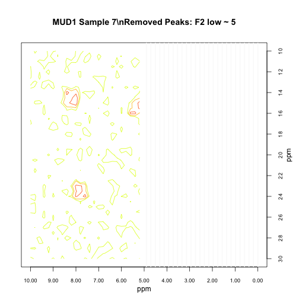

```r
MUD1c <- removePeaks2D(MUD1, remF1 = high ~ 23)
sumSpectra(MUD1c)
```

```
## 
##  MUD1: HSQC-like data for ChemoSpec2D demo & testing 
## 
## 	There are 10 spectra in this set.
## 
## 	The F2 dimension runs from 0 to 10 ppm
## 	and there are 51 data points.
## 
## 	The F1 dimension runs from 10 to 30 ppm
## 	and there are 41 slices.
## 
## 	NAs were found in the data matrices.  To see where, use plotSpectra2D.
## 
## 	The spectra are divided into 2 groups: 
## 
##    group no. color
## 1 GroupA   5   red
## 2 GroupB   5  blue
## 
## 
## *** Note: this is an S3 object
## of class 'Spectra2D'
```

```r
plotSpectra2D(MUD1c, which = 7, lvls = mylvls,
  main = "MUD1 Sample 7\\nRemoved Peaks: F1 high ~ 23")
```

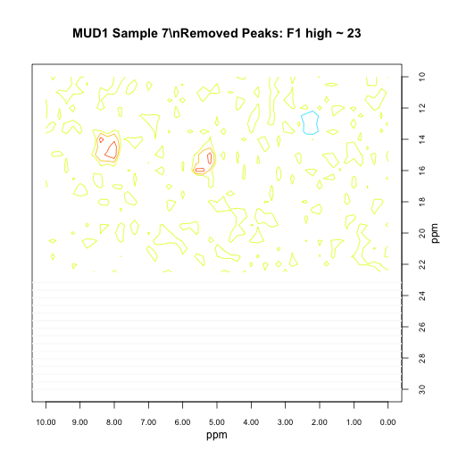

```r
MUD1d <- removePeaks2D(MUD1, remF2 = 2.5 ~ 4, remF1 = 17 ~ 20)
sumSpectra(MUD1d)
```

```
## 
##  MUD1: HSQC-like data for ChemoSpec2D demo & testing 
## 
## 	There are 10 spectra in this set.
## 
## 	The F2 dimension runs from 0 to 10 ppm
## 	and there are 51 data points.
## 
## 	The F1 dimension runs from 10 to 30 ppm
## 	and there are 41 slices.
## 
## 	NAs were found in the data matrices.  To see where, use plotSpectra2D.
## 
## 	The spectra are divided into 2 groups: 
## 
##    group no. color
## 1 GroupA   5   red
## 2 GroupB   5  blue
## 
## 
## *** Note: this is an S3 object
## of class 'Spectra2D'
```

```r
plotSpectra2D(MUD1d, which = 7, lvls = mylvls,
  main = "MUD1 Sample 7\\nRemoved Peaks: F2 2.5 ~ 4 & F1 17 ~ 20")
```

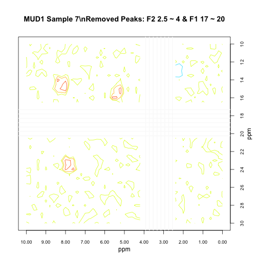


## Spectra2D

```r
data(MUD1)
str(MUD1)
```

```
## List of 8
##  $ F2    : num [1:51] 0 0.2 0.4 0.6 0.8 1 1.2 1.4 1.6 1.8 ...
##  $ F1    : num [1:41] 10 10.5 11 11.5 12 12.5 13 13.5 14 14.5 ...
##  $ data  :List of 10
##   ..$ Sample1 : num [1:41, 1:51] 2.35e-02 9.76e-03 -1.31e-02 2.07e-02 6.15e-05 ...
##   ..$ Sample2 : num [1:41, 1:51] 0.0275 -0.0377 -0.0548 0.0968 -0.0141 ...
##   ..$ Sample3 : num [1:41, 1:51] -0.03273 0.00819 0.00402 -0.0162 0.06004 ...
##   ..$ Sample4 : num [1:41, 1:51] -0.0784 -0.0368 0.0211 -0.01 -0.0217 ...
##   ..$ Sample5 : num [1:41, 1:51] 0.09964 -0.00588 0.04498 -0.05829 -0.0356 ...
##   ..$ Sample6 : num [1:41, 1:51] -0.0444 -0.0998 0.0477 0.0909 -0.041 ...
##   ..$ Sample7 : num [1:41, 1:51] -0.0322 -0.0243 -0.0573 0.0539 0.0537 ...
##   ..$ Sample8 : num [1:41, 1:51] 0.00781 -0.00185 0.01103 0.09974 -0.03219 ...
##   ..$ Sample9 : num [1:41, 1:51] 0.086 -0.052 -0.0493 -0.0161 0.0698 ...
##   ..$ Sample10: num [1:41, 1:51] -0.067148 0.000105 0.082326 0.099195 -0.074405 ...
##  $ names : chr [1:10] "Sample1" "Sample2" "Sample3" "Sample4" ...
##  $ groups: Factor w/ 2 levels "GroupA","GroupB": 1 1 1 1 1 2 2 2 2 2
##  $ colors: chr [1:10] "red" "red" "red" "red" ...
##  $ units : chr [1:3] "ppm" "ppm" "intensity"
##  $ desc  : chr "MUD1: HSQC-like data for ChemoSpec2D demo & testing"
##  - attr(*, "class")= chr "Spectra2D"
```

```r
sumSpectra(MUD1)
```

```
## 
##  MUD1: HSQC-like data for ChemoSpec2D demo & testing 
## 
## 	There are 10 spectra in this set.
## 
## 	The F2 dimension runs from 0 to 10 ppm
## 	and there are 51 data points.
## 
## 	The F1 dimension runs from 10 to 30 ppm
## 	and there are 41 slices.
## 
## 	The spectra are divided into 2 groups: 
## 
##    group no. color
## 1 GroupA   5   red
## 2 GroupB   5  blue
## 
## 
## *** Note: this is an S3 object
## of class 'Spectra2D'
```


