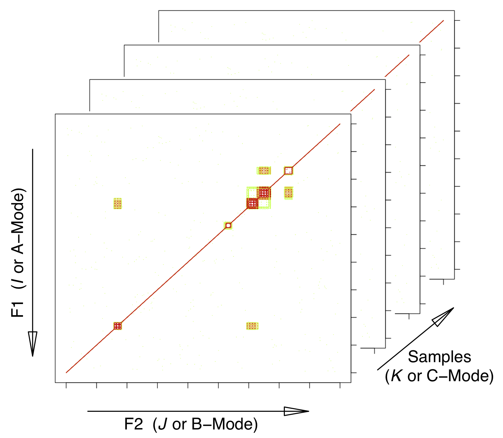

<!-- Run a few things in the background for use later -->
```{r SetUp, echo = FALSE, eval = TRUE, results = "hide"}

# R options & configuration:
set.seed(9)
rm(list = ls())
suppressMessages(library("knitr"))
desc <- packageDescription("ChemoSpec2D")

# Stuff specifically for knitr:
#opts_chunk$set(eval = FALSE)
```

This vignette is based upon `ChemoSpec2D` version `r desc$Version`.

# Background

`ChemoSpec2D` is designed to analyze 2D spectroscopic data such as COSY and HSQC NMR spectra using appropriate chemometric techniques.  It deploys methods aimed primarily at classification of samples and the identification of spectral features which are important in distinguishing samples from each other.  `ChemoSpec2D` stores and manipulates each spectrum as a matrix of data, and hence a data set is a collection of 2D spectra.  Thus the entire data set is naturally visualized as a 3D array with dimensions:

\[
\mathrm{F2} \times \mathrm{F1} \times \mathrm{no. \ samples}
\]

or

\[
\mathrm{2D \ Spectrum} \times \mathrm{no. \ samples}
\]

where F2 and F1 are NMR-speak for the x- and y-axes/dimensions.  We will refer to this array as $\underline{\mathbf{X}}$.  See Figure \@ref(fig:array).

```{r array, out.width = "60%", echo = FALSE, fig.cap = "Configuration of the data array. $I$, $J$ and $K$ are array indices; F2 and F1 are standard terms for NMR dimensions. The mode terminology is typically used in the PARAFAC literature.  This structure is also sometimes referred to as a data cube."}

```


`ChemoSpec2D` treats each spectrum/matrix as the unit of observation, and thus the physical sample that went into the spectrometer corresponds to the sample from a statistical perspective.  Keeping this natural unit intact during analysis is referred to as a *strong* multi-way analysis. In a weak analysis, the 3D data set is unfolded into a series of contiguous 2D matrices and analyzed using methods suitable for any 2D data set (such methods are fundamentally bilinear) (@Huang2003). In the weak approach, each slice of a 2D spectrum becomes just another 1D spectrum, and the relationship between the slices in a single 2D spectrum is lost.  Oddly enough, the trilinear/strong analysis has fewer parameters to estimate so it is simpler, but computationally more demanding.  The interpretation is also more straight-forward.  These techniques are akin to PCA, and seek to *reduce the data to a limited number components represented by scores and loadings*.  As with PCA, noise in the data set is reduced, and correlating variables are collapsed.

The literature on the topics of chemometric analysis of 3D data sets uses a wide variety of terminology to describe analysis options, and the same mathematical analysis can be found under different guises in different fields.  Here are some of the terms relevant to `ChemoSpec2D`:

* Multivariate Image Analysis (MIA).  This term is typically used when the "images" are photographs for example, and the term covers a lot of ground, such as finding particular objects within a photograph.  While 2D NMR spectra are typically plotted as contours, there is no reason why they cannot be plotted as an image or heat plot, which is essentially a photographic image.  Classification using MIA methods involves a TUCKER1 analysis in which each image is the input, and the sample mode (only) is reduced to a requested number of components.  `ChemoSpec2D` can carry out MIA.
* PARAFAC. PARAFAC, or parallel factor analysis, is similar to a method called TUCKER3 in which data reduction occurs on all three dimensions and each dimension can have a different number of factors. With PARAFAC, each dimension is reduced to the *same* number of components. `ChemoSpec2D` can carry out PARAFAC and it is discussed in greater detail below.

Keirs provides discussion and suggestions on terminology best practices (@Kiers2000).

# PARAFAC

## Theory (Light)

PARAFAC is "parallel factor analysis."  This is a statistical technique that is somewhat analogous to PCA.  Recall that PCA decomposes a 2D data set into scores and loadings, and is bilinear:

\[
\mathbf{X}^{(n \ \times \ p)} = \mathbf{C}^{(n \ \times \ R)} \times \mathbf{S}^{(R \ \times \ p)} + \mathbf{E}
\]

Where $\mathbf{X}$ is the raw data, composed of $n$ samples $\times$ $p$ frequencies, $\mathbf{C}$ are the scores, and $\mathbf{S}$ are the loadings.  $R$ is the number of components selected.  $R$ is very much smaller than $p$, as noise and correlating variables have been reduced.  Matrix $\mathbf{C}$ can be thought of as "concentrations" or weights.  Matrix $\mathbf{S}$ is composed of "spectra" which serve as loadings.  $\mathbf{E}$ consists of residuals/error.  The goal of the PCA algorithm is to solve this equation and return $\mathbf{C}$ and $\mathbf{S}$.

In comparison, PARAFAC decomposes a 3D data set into three matrices, and is trilinear.  Because the data is 3D, standard matrix algebra cannot be applied.  However, the math can be expressed as a summation:

\[
x_{ijk} = \sum_{r = 1}^{R} a_{ir}b_{jr}c_{kr} + \epsilon_{ijk}
\]

Where $x_{ijk}$ is an element of the 3D data array $\underline{\mathbf{X}}$. $a_{ir}$ is an element of the matrix $\mathbf{A}$, and so forth for $b$/$\mathbf{B}$ and $c$/$\mathbf{C}$.  $\epsilon$ is the error term.

If $\underline{\mathbf{X}}$ is flattened by taking the $K$-dimension slices and concatenating them left-to-right to give a matrix $\mathbf{X}$, then 2D matrix operations *can* provide a solution:

\[
\mathbf{X} = \mathbf{A}(\mathbf{C} \odot \mathbf{B})^T + \mathbf{E}
\]

Here, $\odot$ represents the Khatri-Rao product, a matrix multiplication variant needed in this situation.  $\mathbf{A}$, $\mathbf{B}$ and $\mathbf{C}$ are the component matrices as above (@Bro2003b, @Smilde2004 Appendix 4.A presents a number of alternative notations for PARAFAC).  If you want to dig into the math, Kolda and Bader is the go-to source (@Kolda2009).

## Interpretation

Regardless of the mathematical representation or algorithmic solution, the results provide $\mathbf{A}$, $\mathbf{B}$ and $\mathbf{C}$.  Interpretation of the component matrices depends upon how $\underline{\mathbf{X}}$ was constructed (i.e. which dimension represents the samples).  In the case of `ChemoSpec2D` $\mathbf{C}$ contains values analogous to scores in that they can be used to see how samples cluster (this is because the samples are the third dimension of $\underline{\mathbf{X}}$).  Standard matrix multiplication of $\mathbf{A} \ \times \ \mathbf{B^T}$ for a particular column (component) gives a 2D loading plot (a pseudo-spectrum) showing the contributions (loadings) of each peak to the component. `ChemoSpec2D` uses the `R` package `multiway` to carry out PARAFAC (@Helwig2019).

# References
